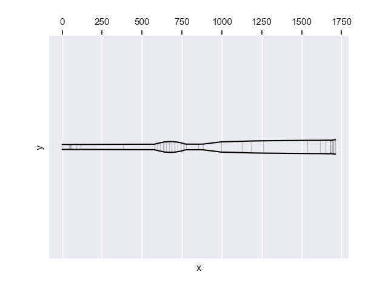
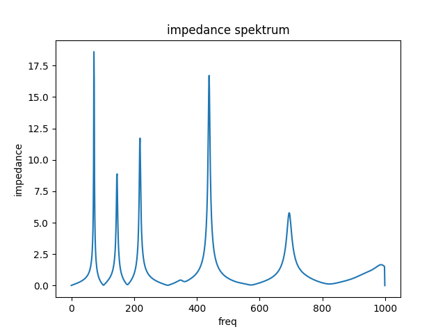
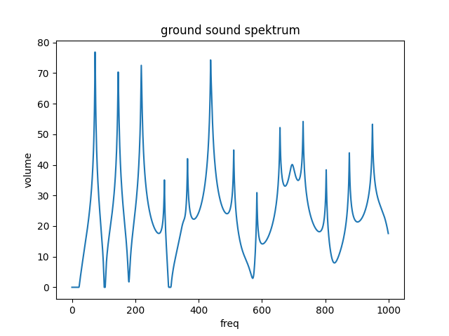

# Arusha 1

The Arusha series is designrd to have especially many resonant frequencies and toots that are tuned in the minor scale. Arusha 1 shape has especially high resonant frequencies above the drone frequency.

## Geometry
* Length: 1712 mm
* Bell Diameter: 91 mm
* Download geometry: [geo.txt](geo.txt)

Download geometry

* [JSON format](geo.json)
* [text format](formated_geo.txt)



## Tuning of resonant frequencies

```
 freq impedance rel_imp  note-number cent-diff note-name
 73.4  2.17e+07    1.00          -31      0.38        D1
147.0  8.88e+06    0.41          -19     -1.98        D2
220.0  1.17e+07    0.54          -12      0.00        A3
349.0  4.37e+05    0.02           -4      1.13        F3
440.0  1.67e+07    0.77            0      0.00        A4
695.0  5.79e+06    0.27            8      8.59        F4
988.0  1.66e+06    0.08           14     -0.41        B5
```



## Ground Tone Spektrum



## How to create it?

```
python -m cad.evo.evolve_arusha
```