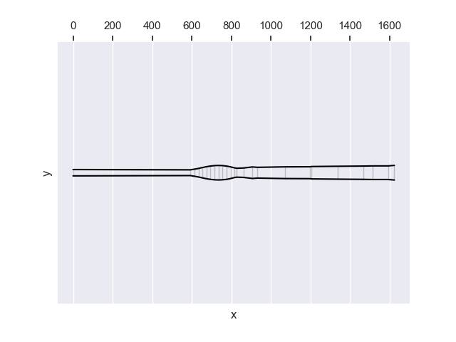
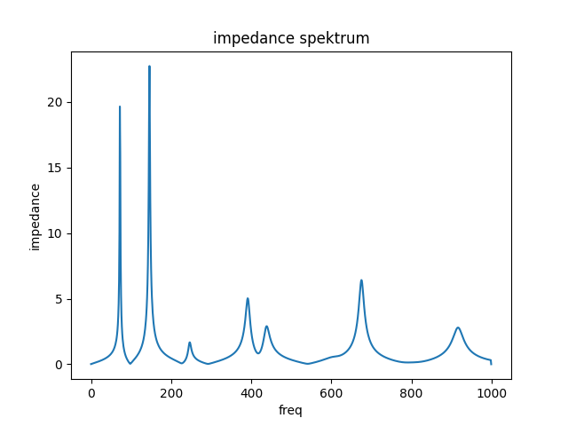
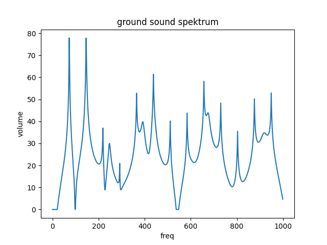

# Arusha 2

The Arusha series is designed to have especially many resonant frequencies and toots that are tuned in the minor scale. The interesting property of Arusha 2 is that the first toot has a larger imepdance than the drone.

## Geometry

* Length: 1624 mm
* Bell Diameter: 74 mm

Download geometry

* [JSON format](geo.json)
* [text format](formated_geo.txt)



## Tuning of resonant frequencies

```
 freq impedance rel_imp  note-number cent-diff note-name
 73.4  2.23e+07    1.00          -31      0.38        D1
147.0  2.27e+07    1.02          -19     -1.98        D2
247.0  1.67e+06    0.07          -10     -0.41        B3
392.0  5.03e+06    0.23           -2     -0.02        G3
440.0  2.90e+06    0.13            0      0.00        A4
676.0  6.42e+06    0.29            7    -43.42        E4
917.0  2.80e+06    0.13           13     28.70       A#5
```



## Ground Tone Spektrum



## How to create it?

```
python -m cad.evo.evolve_arusha
```