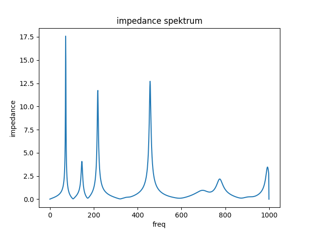
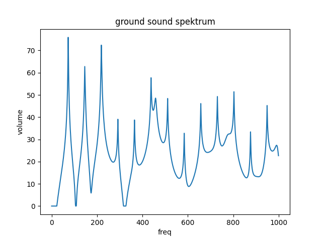

# Arusha 3

The Arusha series is designed to have especially many resonant frequencies and toots that are tuned in the minor scale. Arusha 3 should have a bright tone because of the strong higher resonant frequencies.

## Geometry

* Length: 1717 mm
* Bell Diameter: 113 mm

Download geometry

* [JSON format](geo.json)
* [text format](formated_geo.txt)


## Tuning of resonant frequencies

```
 freq impedance rel_imp  note-number cent-diff note-name
 73.4  1.92e+07    1.00          -31      0.38        D1
147.0  4.07e+06    0.21          -19     -1.98        D2
220.0  1.17e+07    0.61          -12      0.00        A3
458.0  1.27e+07    0.66            1     30.59       A#4
698.0  9.61e+05    0.05            8      1.13        F4
776.0  2.18e+06    0.11           10     17.74        G4
993.0  3.46e+06    0.18           14     -9.15        B5
```



## Ground Tone Spektrum



## How to create it?

```
python -m cad.evo.evolve_arusha
```