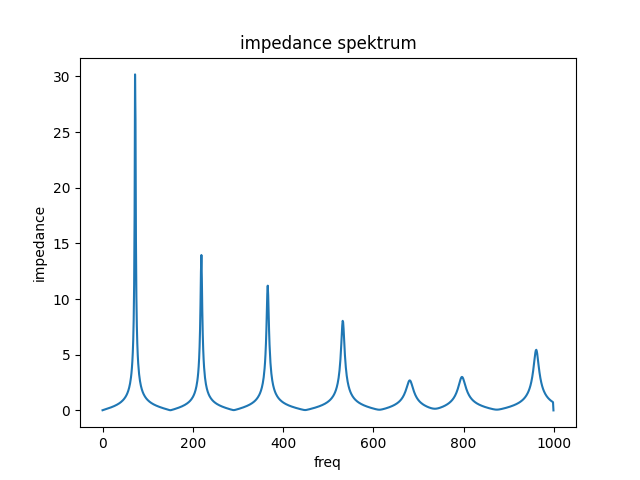
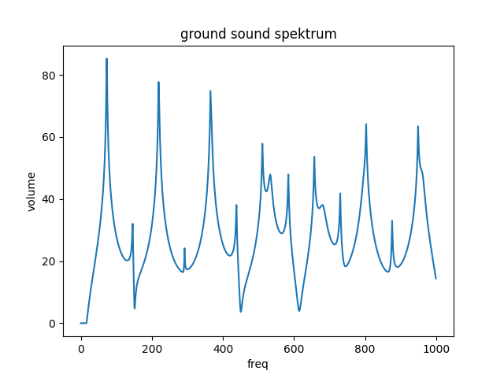

# Kizimkazi

Kizimkazi is tuned in D and should have two singer notes. The position of the bell end is at the same position as maximum values of the sound wave of the 2nd and the 4th harmonic. At the same time, these are resonant frequencies of the didgeridoo.

## Geometry

* Length: 1144 mm
* Bell Diameter: 39 mm

Download geometry

* [JSON format](geo.json)
* [text format](formated_geo.txt)


## Tuning of resonant frequencies

```
 freq impedance rel_imp  note-number cent-diff note-name
 73.4  3.25e+07    1.00          -31      0.38        D1
220.0  1.40e+07    0.43          -12      0.00        A3
367.0  1.12e+07    0.34           -3     14.07       F#3
533.0  8.05e+06    0.25            3    -31.96        C4
682.0  2.69e+06    0.08            8     41.28        F4
797.0  3.01e+06    0.09           10    -28.49        G4
962.0  5.44e+06    0.17           14     45.76        B5
```



## Ground Tone Spektrum



## How to create it?

```
python -m cad.evo.evolve_arusha
```