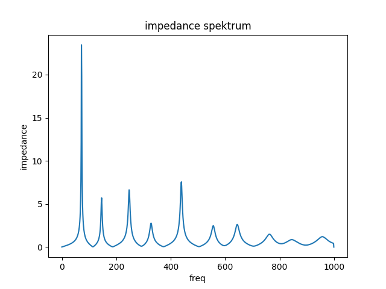
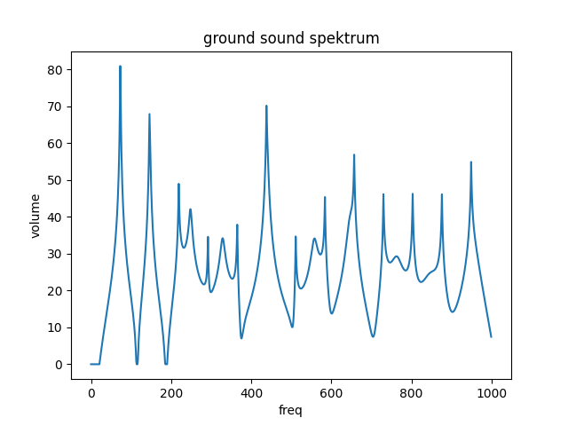

# Matema

Matema is tuned in D, has toots in the minor scale and a singer note at A, 440 Hz.

## Geometry

* Length: 1705 mm
* Bell Diameter: 70 mm

Download geometry

* [JSON format](geo.json)
* [text format](formated_geo.txt)


## Tuning of resonant frequencies

```
 freq impedance rel_imp  note-number cent-diff note-name
 73.4  2.66e+07    1.00          -31      0.38        D1
147.0  5.71e+06    0.21          -19     -1.98        D2
248.0  6.64e+06    0.25          -10     -7.40        B3
329.0  2.78e+06    0.10           -5      3.30        E3
440.0  7.56e+06    0.28            0      0.00        A4
557.0  2.48e+06    0.09            4     -8.21       C#4
645.0  2.63e+06    0.10            7     37.85        E4
763.0  1.50e+06    0.06           10     46.98        G4
846.0  8.62e+05    0.03           11    -31.78       G#4
958.0  1.20e+06    0.05           13    -47.03       A#5
```



## Ground Tone Spektrum



## How to create it?

```
python -m cad.evo.evolve_arusha
```